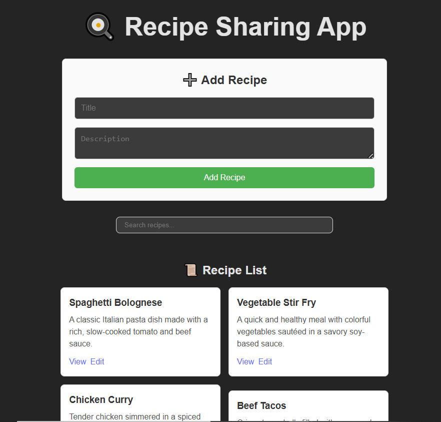
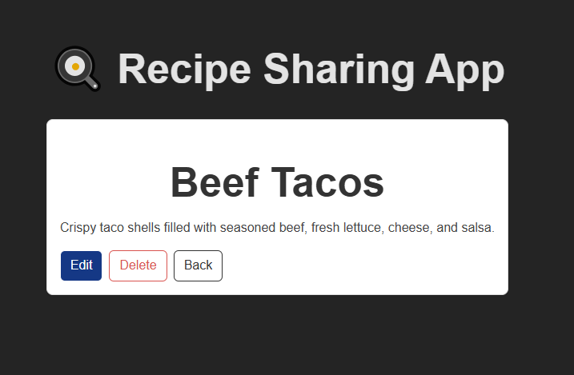
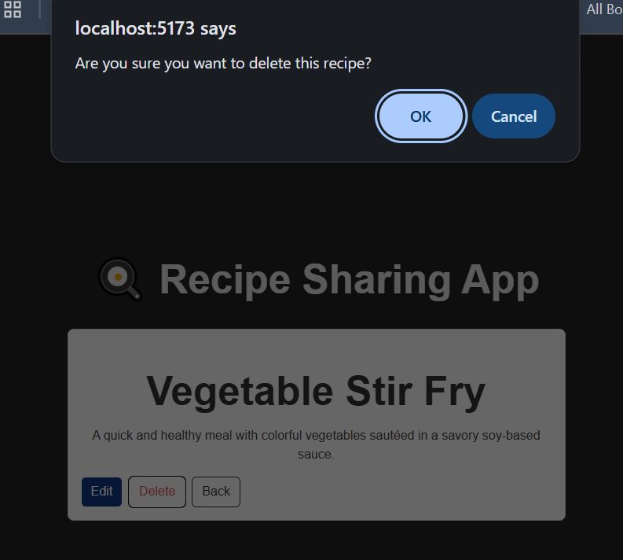

# 🍳 Recipe Sharing App

A simple **React + Zustand** application where users can add and view recipes.

This is the foundation of a recipe sharing platform built during the **ALX Frontend Engineering program**.

---

## Features

- Add new recipes with title and description
- View all added recipes in a clean list
- Global state management powered by **Zustand**
- Simple and beginner-friendly React components

---

## Tech Stack

# 🍳 Recipe Sharing App

[](https://react.dev/)
[](https://vitejs.dev/)
[](https://github.com/pmndrs/zustand)
[](https://developer.mozilla.org/en-US/docs/Web/JavaScript)

---

## Project Structure

```

src/
├── components/
│   ├── AddRecipeForm.jsx   # Form to add new recipes
│   └── RecipeList.jsx      # Displays list of recipes
├── store/
│   └── recipeStore.js      # Zustand store
├── App.jsx                 # Main app entry
└── main.jsx                # ReactDOM entry point

```

---

## Setup & Run Locally

Clone the repo:

```bash
git clone https://github.com/Mia06-coder/alx-fe-reactjs.git
cd alx-fe-reactjs/recipe-sharing-app
```

Install dependencies:

```bash
npm install
```

Run the dev server:

```bash
npm run dev
```

Open your browser at [http://localhost:5173](http://localhost:5173).

---

## Preview

| Add Recipe & List                                                  | Recipe Details                                        | Edit Recipe Form                                      |
| ------------------------------------------------------------------ | ----------------------------------------------------- | ----------------------------------------------------- |
|  |  |  |

| Edited Recipe Displayed                                         | Delete Recipe                                        | Search Recipe                                                 |
| --------------------------------------------------------------- | ---------------------------------------------------- | ------------------------------------------------------------- |
|  |  |  |

---

## License

MIT License © 2025

---

## Credits

- Project idea & structure inspired by [ALX](https://www.alxafrica.com/) exercises
- Icons and badges from [Shields.io](https://shields.io/)

---

## Contact

Made with ❤️ by **Mia Mudzingwa**

- GitHub: [Mia06-coder](https://github.com/Mia06-coder)
- LinkedIn: [mia-mudzingwa](https://www.linkedin.com/in/mia-mudzingwa)
